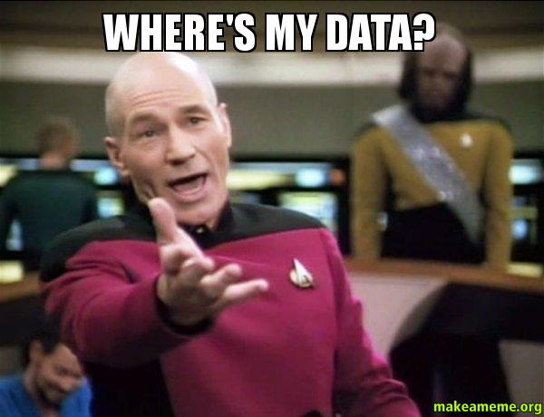
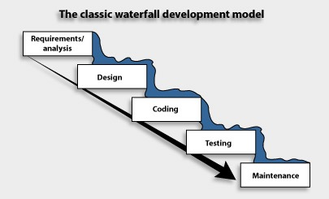
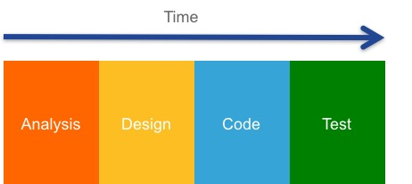
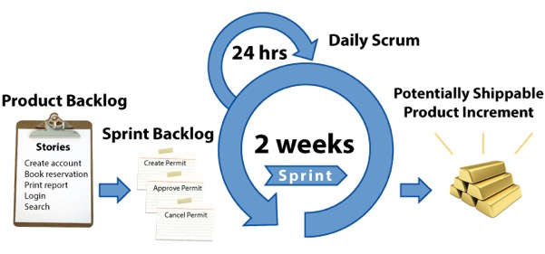
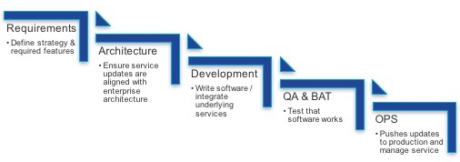
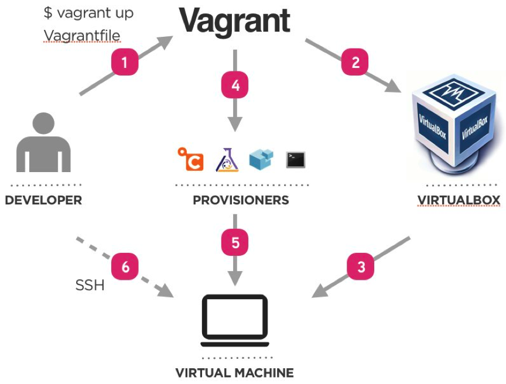
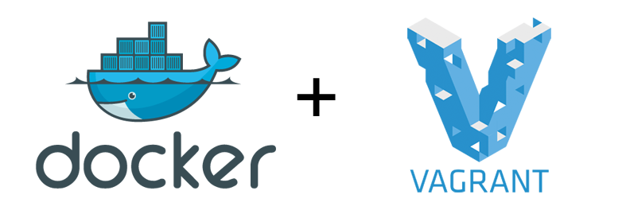
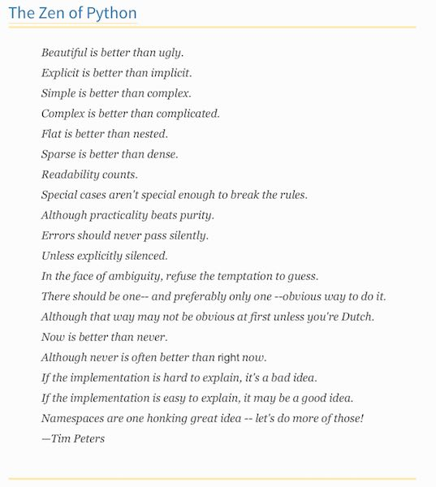
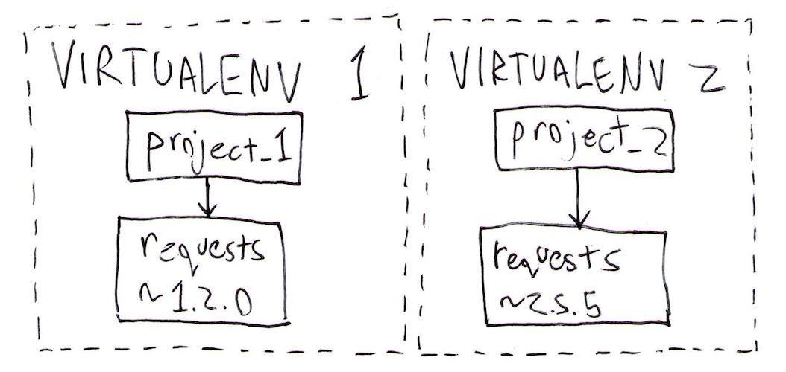

[item]: # (slide)


# Module: General Development


[item]: # (/slide)

[item]: # (slide)
## Main Topics

### Concepts
* [Application Architecture](#application-architecture)
* [Software Development Lifecycle](#software-development-lifecycle)
* [Application Operations](#application-operations)
* [OpenSource Licenses](#opensource-licenses)

[item]: # (/slide)

[item]: # (slide)

## Application Architecture


[item]: # (/slide)

**Architecture** - *the complex or carefully designed structure of something*

Software architecture is the structure of an information system consisting of entities their properties, and the relationships among them. There are many ways an application can be architected, and the leading architecture of the time changes.  

Till recently, the leading software architecture was commonly referred to as *Client-Server* and is still quite popular and used in many active development projects.  With the advent of "cloud" and the explosion of technology and applications throughout our personal and professional worlds, a new architecture called *Micro-Service* has arisen and become quite popular.  

[item]: # (slide)

## Traditional Client-Server Architecture


[item]: # (/slide)

For years Client-Server Applications have been the foundation of business.  ERPs, CRMs, Medical Records, Warehouse Management, Point of Sale, etc have all been built with this architecture in mind.  Web/App/Data is another way of referring to this architectural model.  This architecture can be broken into three common components.  

First, is the Presentation Layer which is the "client" in client/server.  This is how end users interact with the application.  This interaction could be via a *thick client* application installed onto a workstation, or, more common in recent times, a web interface.  In this architecture, there is tyipcally a single application/website with which end users interact with the application.

Secondly is the Application Layer which would be the "server" in client/server.  Here is where the business logic for the application is all handled.  Though some large applications may have multiple application servers in the architecture, most applications look to minimize the number of application servers to the minimum needed to provide the needed logic.  Few, but large and powerful application servers is quite common.  

Lastly is the Data Layer.  With client/server applications you will typically find a single Relational Database (common options would be Microsoft SQL Server, Oracle, or MySQL) that stores all the data processed and leveraged by clients of the application.  

In some applications you will find the application and data layers installed on a single server instance, or they may be seperated onto different servers and communicate over the network.  

There are some key reasons this Architecture worked so well for so long.  

* For years application designers knew exactly who their users were, where they were coming from, and how many there might be.  
* Business logic, and therefore applications, didn't change that often.  This meant that maintaining a small number of complex systems was seen as the *simple* option.  
* The data that was interesting and tracked was transactional and contained clear boundaries and relationships.  

[item]: # (slide)

## Micro-Service Architecture


[item]: # (/slide)

Today, most modern applications (also commonly called Cloud Native, or Cloud Born) are designed using a Micro-service Architecture.  It is easiest to understand micro-service architecture as a comparison to the commonly understood Client-Server.  

Rather than have a single client providing the presentation layer for users, micro-service applications are designed with the understanding that the method users will interact with the application will be varied and change over time.  Forcing a user to install software onto their computer or use a web page from a computer today is a way to nearly gaurantee your applciation to fail today.  Users are demanding Mobile-First options across a wide variety of device types.  Wearable technology like smartwatches are also becoming popular and mastering this interface will be important for developers.  And then are the even more bleeding edge interfaces like voice and virtual reality.  Micro-service applciations are designed to make it easy to launch new interfaces for users quickly and easily.  

In a micro-service application, the business logic elements are deconstructed into small, self-contained elements that can be developed, deployed and managed independent of each other.  This aspect of the architecture is where the term *micro-service* comes from.  Each micro-service provides capabilities through a consistent and well documented API (mostly commonly today REST) to other micro-services or directly to client applications.  Developers are still striving for simplicity, and because of how quickly the application requirements change, this architecture provides simplicity by allowing each element of the application to evolve independent of each other.  

But this architecture comes with a price.  Micro-service architecture offers new challenges that Client-Server lacks.  Examples include: 

* Loosely couple components and development teams require extra effort be made related to API development and documentation 
* The underlying network is even more important as a single request from a user could generate hundreds of transactions 
* With each service providing an exposed interface and attack vector, security must be considered even more 
* Tracking addresses and identities for services in a scalable fashion 
* Operational challenges of a quickly changing, highly distrubted application pressure traditional models

And finally, the data leveraged in a modern application is very different from the single relational database of a traditional application.  Big Data is throughout these applicaitons, and a single application may pull in data from a dozen or more differnet data sources, some of which may not even be owned or controlled by the application owner themselves.  

[item]: # (slide)
## The 12 Factor Application


[item]: # (/slide)

[item]: # (slide)
## What is a "12 Factor" App and where did it come from

Full details at [12Factor.net](http://12factor.net) 

[item]: # (/slide)

The 12 Factor Application is a methodology proposed in the early 2010s by core members of the Heroku team.  It is a well circulated and read proposal that focuses on "Cloud Native" application design concepts, however it is not perfect or univerally accepted.  Most will agree that it provides an ideal to strive towards, and a _violation_ of a factor should be done consciously and with reason.  

It is not the only _manifesto_ on Cloud Native development, but it is worth having exposure and understanding of.  


[item]: # (slide)
## The Factors 

### I. [Codebase](http://12factor.net/codebase)
One codebase tracked in revision control, many deploys

### II. [Dependencies](http://12factor.net/dependencies)
Explicitly declare and isolate dependencies

### III. [Config](http://12factor.net/config)
Store config in the environment

### IV. [Backing services](http://12factor.net/backing-services)
Treat backing services as attached resources

[item]: # (/slide)
[item]: # (slide)

### V. [Build, release, run](http://12factor.net/build-release-run)
Strictly separate build and run stages

### VI. [Processes](http://12factor.net/processes)
Execute the app as one or more stateless processes

### VII. [Port binding](http://12factor.net/port-binding)
Export services via port binding

### VIII. [Concurrency](http://12factor.net/concurrency)
Scale out via the process model

[item]: # (/slide)
[item]: # (slide)

### IX. [Disposability](http://12factor.net/disposability)
Maximize robustness with fast startup and graceful shutdown

### X. [Dev/prod parity](http://12factor.net/dev-prod-parity)
Keep development, staging, and production as similar as possible

### XI. [Logs](http://12factor.net/logs)
Treat logs as event streams

### XII. [Admin processes](http://12factor.net/admin-processes)
Run admin/management tasks as one-off processes

[item]: # (/slide)

[item]: # (slide)
## A Stateless Aspiration


[item]: # (/slide)

The 12 Factor Application describes a goal of a **stateless application**.  The refers to the goal that applications (and their components) should be able to come and go without any overall impact to the user or data.  This is core to the ablity to be fully "cloud native" and drive towards fully automated operations and portablity.  

This is a great target goal, and for many applications, or microservices within an application, it is useful and practical.  But as an overall strategy it has some significant problems that are important to be aware of.  

### Where's the data?

[item]: # (slide)



[item]: # (/slide)

Nearly every application of significance has a need to gather, manipulate, store, and report on data.  At it's core, the 12 Factor principals do not accomidate for how to deal with data. 


[item]: # (slide)

## Software Development Lifecycle


[item]: # (/slide)

The Software Development Lifecycle (SDLC) is the process an application development team follows to build their application.  There are many many SDLC methologies including:

* Waterfall
* Prototyping
* Rapid Application Development
* Extreme Programming
* Agile

SDLC is different from Application Architecture, and though there are common pairings between architecture and methodology, you could pair them up however you want.  

[item]: # (slide)

## Waterfall Methodology



[item]: # (/slide)

The Waterfall Methodology has been around since the 50's and is still widely leveraged today.  A key aspect of Waterfall projects is that the requirements and scope are determined at the very beginning of the project, and all effort proceeds logically from concept to finished progress to achieve the project goal.  

Waterfall was originally developed at a time when the effort to actually build and test software was very expensive and time consuming.  This lead to project teams spending a great deal of time upfront ensuring they completely understood the goals and scope so that once they began the development they would have the clear focus on what was to be built.  Experimentation, idea gathering, and creativity is front-loaded in a Waterfall project.  

[item]: # (slide)

## Waterfall Timeline



[item]: # (/slide)

Time is always linear, and across the time of a waterfall project the team moves from one phase to the next until complete.  A major critism of Waterfall projects is that projects often fall behind schedule and there are delays in shipping products.  This can often result in time being sacraficed from the Test phase, which can lead to software quality issues.  

A key point to note here as we move into Agile Development, is that after 50% of time has been spent on a project, no code has been written, and no product exists.  

[item]: # (slide)

## Agile Development



[item]: # (/slide)

Agile development is quite different from Waterfall, and reflects the nature of the more modern state of application development and business expectations.  Agile projects focus on some two value points:

* Requirements change quickly
* Get to market fast

It isn't that these weren't also true in the 50s, the difference is that the state of technology allows for developers to change their behavior to meet them better today.  The cost in time and money to do the actual development is a fraction of what it used to be, so organizations can afford to experiment when developing and coding, and potentially throw away code that doesn't work.  

### Key Agile Terms

* User Story
    * A user story is a tool used in Agile software development to capture a description of a software feature from an end-user perspective. The user story describes the type of user, what they want and why. A user story helps to create a simplified description of a requirement.
    * Source: [What is a User Story?](http://searchsoftwarequality.techtarget.com/definition/user-story)
* Sprint
    * In product development, a sprint is a set period of time during which specific work has to be completed and made ready for review.
    * Source: [Sprint](http://searchsoftwarequality.techtarget.com/definition/Scrum-sprint)
* Scrum
    * In the Scrum method of Agile software development, work is confined to a regular, repeatable work cycle, known as a sprint or iteration. Scrum sprints used to be 30 days long, but today we advise one-week or two-week sprints. ... Scrum is iterative and incremental.
    * Source: [Scrum Sprint](http://searchsoftwarequality.techtarget.com/definition/Scrum-sprint)
* Standup
    * The daily stand-up meeting (also known as a "daily scrum", a "daily huddle", "morning roll-call", etc.) is simple to describe: The whole team meets every day for a quick status update. We stand up to keep the meeting short.
    * Source: [It's Not Just Standing Up: Patterns for Daily Standup Meetings](http://martinfowler.com/articles/itsNotJustStandingUp.html)
* Minimum Viable Product (MVP)
    * The Minimum Viable Product. The minimum viable product (MVP), as defined by Eric Ries, is a learning vehicle. It allows you to test an idea by exposing an early version of your product to the target users and customers, to collect the relevant data, and to learn from it.
    * Source: [The Minimum Viable Product & the Minimal Marketable Product](http://www.romanpichler.com/blog/minimum-viable-product-and-minimal-marketable-product/)

[item]: # (slide)

## Agile Timeline


[item]: # (/slide)

Time is still linear in an Agile project, but the way the time is used differs greatly.  Within each Sprint, the developers perform the Analysis, Design, Code and Testing needed to deliver the User Stories that make up the Sprint.  And at any point in time, there is a feasibly shippable product.  

[item]: # (slide)

## Application Operations


[item]: # (/slide)

[item]: # (slide)

## Traditional Operations



[item]: # (/slide)

Traditional IT Operations are organized around different teams focusing on one element of the overall goal.  Business leaders determine what is needed, Enterprise Architects take the goals from the leaders and design a solution.  Developers build the products.  QA engineers test to make sure it operates as designed.  And lastly the Operations teams implement and maintain the solution.  

This orgainziation structure and culture has lead to several very funny memes, but they tend to focus on the truth of the divided nature of IT delivery, and the challenges that it causes in accountability and success.

[item]: # (slide)

## DevOps


[item]: # (/slide)

DevOps is a new operations model focused on leveraging some of the best techniques from Agile and Lean to combine Development and Operations (and often test/QA) into a single team that is responsible for the full delivery of a software solution.  

DevOps brings accountabilty for software together in a mindset of "If you build it, you own it".  

The Guiding principals of DevOps include: 

* Culture
* Automation
* Lean
* Metrics 
* Sharing

[item]: # (slide)


> “[DevOps is] a set of cultural norms and technical practices that enable this fast flow of work from dev through test through operations while preserving world class reliability” 
> ~ Gene Kim - author of “The Phoenix Project”

[item]: # (/slide)

DevOps is often talked about in the nature of the tools and techniques that are implemented as part of a pipeline, but DevOps is much more about the culture of an organization than about whether they are leveraging Jenkins.  

[item]: # (slide)
# Why do we Care? 

[item]: # (/slide)

Software development is like any other area of IT.  There are basic capabilities and technologies, then there are strategies for using them.  When we want to be relevant to network engineers, we study strategies and design with "3 Tier Network Architectures" and more recently "Spine-Leaf" in mind.  When we want to be relevant to software developers, we need to understand the common practices and methods to engage in discussions.  


[item]: # (slide)
## A sidebar on Secrets


[item]: # (/slide)

In development a "secret" can loosely be defined as anything you wouldn't want everyone else in the world to know.  This includes the obvious things like: 

[item]: # (slide)
### Obvious Secrets 

* Passwords 
* Authentication Tokens
* Usernames 
* Credit Card
* Account Information 

[item]: # (/slide)

But it can also include things that aren't as directly damaging if they are lost such as: 

[item]: # (slide)
### Also Secrets

* Application and Server Names 
* API Endpoints and addresses 
* Email Addresses 
* IP Addresses and Port Numbers
* Domain Names 
* just about anythind descriptive about your environment... 

[item]: # (/slide)

**Factor III: Config** talks about NOT including environment details in your code, but rather in the environment.  In many cases the "environment details" also qualify as **secrets** and you need to take care about how you are storing and transporting them throughout application development and deployment process.  It is very easy to commit secrets into a codebase (ie GitHub) and mistakeningly make your usernames and passwords publicly available on GitHub.


[item]: # (slide)
### Cautionary Tail... 

* Example of what can happen: [$6,000 AWS Bill Overnight](https://wptavern.com/ryan-hellyers-aws-nightmare-leaked-access-keys-result-in-a-6000-bill-overnight)
* Handy reference on what to do: [Remove sensitve data from GitHub](https://help.github.com/articles/remove-sensitive-data/)

[item]: # (/slide)

[item]: # (slide)
## Links 

### Application Architecture 
* [http://12factor.net](http://12factor.net)
* [https://cncf.io](https://cncf.io)

### Software Development Lifecycle
* [http://www.agilemanifesto.org](http://www.agilemanifesto.org)

### Application Operations
* [http://www.realgenekim.me](http://www.realgenekim.me)
* [https://aws.amazon.com/devops/what-is-devops/](https://aws.amazon.com/devops/what-is-devops/)

[item]: # (/slide)

[item]: # (slide)
# OpenSource 


[item]: # (/slide)

[item]: # (slide)
## What is OpenSource 

>"Open source software is software with source code that anyone can inspect, modify, and enhance." 
>~ [OpenSource.com](https://opensource.com/resources/what-open-source) 

[item]: # (/slide)

[item]: # (slide)
##Is OpenSource "Free"?


[item]: # (/slide)

No... sorta... not really... 

OpenSource licenses often require the software be free to distribute, but there is typically no limitation on charging for Support, Installation, Troubleshooting, etc.  ie RedHat's Model 

Also, developing OpenSource software is no simpler than developing proprietary software.  Some projects are done as side projects, but many are done by paid programmers.  

[item]: # (slide)
## Why do people like OpenSource? 

* Control
* Training
* Security
* Stability 

[item]: # (/slide)

Lots of reasons... many cite

[item]: # (slide)
## Is OpenSource inherintly better, more stable, more secure?  


[item]: # (/slide)

[item]: # (slide)


Nope... remember [Heartbleed](https://en.wikipedia.org/wiki/Heartbleed)

[item]: # (/slide)

[item]: # (slide)
## Considerations for Choosing a License

* Permissions
* Conditions
* Limitations

[item]: # (/slide)

Any software product has a "license" that is attached.  We see and agree to these licenses all the time, but we've become so accustomed to "Click to accept" that we don't even realize it.  

With OpenSource Projects, you could write your own license that said whatever you wanted, but that's kinda boring.  So there are several available options that are often used.  

Licenses will typically address the above characteristics. And their treatment of each often determines what license makes sense for a project.  

[item]: # (slide)

### Permissions
***What are you allowed to do...***

* **Use - Commercial vs Private**
	* Can you use the software to make money
* **Distribution**
	* Are you allowed to freely distribute the software
* **Modification**
	* Are you allowed to change the software
* **Patent Use**
	* Can you use the software as part of a patent

[item]: # (/slide)

[item]: # (slide)
### Conditions
***What must you do...*** 

* **OpenSource** 
	* Actually provide the source code 
* **License and Copyright Notificaitons** 
	* Clearly indicate that you are using the licensed products 
* **Copyleft**
	* Whether other products, products must use the same license 
* **State Changes**
	* Explicitly state all changes  

[item]: # (/slide)

[item]: # (slide)

### Limiations
***Protections and other footnotes***

* **Liability**
	* Whether the creator can be held liable for damages
* **Trademark Use**
	* Usage related to trademarking. 

[item]: # (/slide)

[item]: # (slide)

## Some Common Licenses 

* [MIT License](http://choosealicense.com/licenses/mit/)
* [GNU GPL License](http://choosealicense.com/licenses/gpl-3.0/)
* [GNU LGPL License](http://choosealicense.com/licenses/lgpl-3.0/)
* [Apache License](http://choosealicense.com/licenses/apache-2.0/)

[item]: # (/slide)

### MIT license
A short and simple permissive license with conditions only requiring preservation of copyright and license notices. Licensed works, modifications, and larger works may be distributed under different terms and without source code.

[MIT License](http://choosealicense.com/licenses/mit/)

### GNU General Public License (GPL)
Permissions of this strong copyleft license are conditioned on making available complete source code of licensed works and modifications, which include larger works using a licensed work, under the same license. Copyright and license notices must be preserved. Contributors provide an express grant of patent rights.

[GNU GPL License](http://choosealicense.com/licenses/gpl-3.0/)

### GNU Library or "Lesser" General Public License (LGPL)
Permissions of this copyleft license are conditioned on making available complete source code of licensed works and modifications under the same license or the GNU GPLv3. Copyright and license notices must be preserved. Contributors provide an express grant of patent rights. However, a larger work using the licensed work through interfaces provided by the licensed work may be distributed under different terms and without source code for the larger work.

[GNU LGPL License](http://choosealicense.com/licenses/lgpl-3.0/)

### Apache License 2.0
A permissive license whose main conditions require preservation of copyright and license notices. Contributors provide an express grant of patent rights. Licensed works, modifications, and larger works may be distributed under different terms and without source code.

[Apache License](http://choosealicense.com/licenses/apache-2.0/)

[item]: # (slide)
# Links (and sources)

* [https://opensource.com/resources/what-open-source](https://opensource.com/resources/what-open-source)
* [https://en.m.wikipedia.org/wiki/Comparison_of_free_and_open-source_software_licenses](https://en.m.wikipedia.org/wiki/Comparison_of_free_and_open-source_software_licenses)
* [http://choosealicense.com/licenses/](http://choosealicense.com/licenses/)
* [https://opensource.com/education/12/7/clearing-open-source-misconceptions](https://opensource.com/education/12/7/clearing-open-source-misconceptions)


[item]: # (/slide)

[item]: # (slide)
# Why Do We Care? 

[item]: # (/slide)

OpenSource has always been popular, but its popularity is raising at a very fast level.  We are seeing large enterprises, across verticles, embracing OpenSource Software like never before.  And this is in some very critical areas where traditionally they would have selected a more traditional commercial vendor.  Even commercial software vendors, traditionally very anti-OpenSource, are starting to embrace OpenSource in a big way.  This could be as a user, contributor, or initiator of projects.  

Not all OpenSource projects and licenses are the same though, and as you jump into this world as an individual, you need to be able to differentiate between the different licenses that you'll run into so you can make apprporiate decisions about which projects to use and contribute to.  Also, deciding on an appropriate license for your own projects is an important decision that can have significant consequenses.  


[item]: # (slide)
## Go Do It Exercises 

Look at some popular OpenSource projects and find the license that they are published under.  Here are some ideas, but feel free to look elsewhere.  

* Ubuntu
* Apache
* HA-Proxy
* Cisco Mantl
* Terraform
* Vagrant
* Cisco Contiv

[item]: # (/slide)

[item]: # (slide)
## Main Topics, part 2

### Practical Skills
* [Basic Linux Tools](#basic-linux-tools)
* [Markdown](#markdown)
* [Vagrant](#vagrant)
* [Python Skills](#python-skills)
* [Writing and Using Test Cases](#writing-test-cases)
* [Linting](#linting)

[item]: # (/slide)

[item]: # (slide)
# Basic Linux Tools

* [curl](#curl)
* [awk](#awk)
* [grep](#grep)
* [sed](#sed)
* [bash scripts](#bash-scripts)

[item]: # (/slide)

[item]: # (slide)

> See, you not only have to be a good coder to create a system like Linux, you have to be a sneaky bastard too. -Linus Torvalds

--- 

> Linux has never been about quality. There are so many parts of the system that are just these cheap little hacks, and it happens to run. -Theo de Raadt

[item]: # (/slide)

[item]: # (slide)
## Don't forget the "Ops" in DevOps...


[item]: # (/slide)

Some of the most difficult parts of developing are often less about coding, and more about operational tasks.  But since the big theme in development these days is **Dev"Ops"** we can't get away from those tasks.  

Scripting has long been the swiss army knife for operations, and it continues to be valuable today.  There are several common Linux utilities that having a basic fundamental knowledge of will help you greatly as you work to develop and package your applications for others to use.  

[item]: # (slide)
## Hands On Prep

* [wunderground](https://www.wunderground.com/weather/api/)
* [developer.ciscospark.com](https://developer.ciscospark.com)

```
export WEATHER_API_KEY=<YOUR KEY>
export SPARK_TOKEN=<YOUR TOKEN>
export MY_EMAIL=<YOUR EMAIL>
export PARTNER_EMAIL=<A LAB PARTNERS EMAIL>
```

[item]: # (/slide)

The following examples leverage the Weather.com API and Cisco Spark APIs.  Developer access to the APIs is free and accounts can be created at the links above.  

Once you have the key/tokens, use the export statements to make them available for the exercises.  

---

[item]: # (slide)
# curl

```
curl -H "Authorization: Bearer $SPARK_TOKEN" \
		https://api.ciscospark.com/v1/teams
```

[item]: # (/slide)

curl is a general purpose command line utility for making requests to web servers.  It is often used for testing REST API calls, verifying a site is up and operational, or as part of bash scripts.  The number of potential arguments and options to curl can be mind-boggling, however knowing the following subset can be highly valuable as you get started.  


[item]: # (slide)
# Examples and Exercises 

[item]: # (/slide)

* Basic curl request
  
  ```
  # List the Spark Teams you are a member of
  curl https://api.ciscospark.com/v1/teams
  
  # No data should be returned... 
  ```

* Inspect the HTTP Headers with `-v` to find out what happened... 
  
  ```
  curl -v https://api.ciscospark.com/v1/teams
  
	*   Trying 104.239.247.152...
	* Connected to api.ciscospark.com (104.239.247.152) port 443 (#0)
	* TLS 1.2 connection using TLS_ECDHE_RSA_WITH_AES_256_GCM_SHA384
	* Server certificate: *.ciscospark.com
	* Server certificate: Go Daddy Secure Certificate Authority - G2
	* Server certificate: Go Daddy Root Certificate Authority - G2
	> GET /v1/teams HTTP/1.1
	> Host: api.ciscospark.com
	> User-Agent: curl/7.43.0
	> Accept: */*
	>
	< HTTP/1.1 401 Unauthorized
	< Content-Length: 0
	< Date: Tue, 26 Jul 2016 20:32:26 GMT
	< Server: Redacted
	< Trackingid: NA_69b0048b-3bab-4175-a2c0-f9272ba99c2d
	< X-Cf-Requestid: 9b78f835-9d29-46a9-5211-27c5cf34f59e
	< Content-Type: text/plain; charset=utf-8
	<
	* Connection #0 to host api.ciscospark.com left intact  
  ```  
  * Lines beginning with `>` indicate outgoing **REQUEST** headers while those with `<` are for incoming **RESPONSE** headers
  * The first **RESPONSE** header `HTTP/1.1 401 Unauthorized` indicates the problem.  We are _Unauthorized_. 
  * Most APIs require authentication/authorization
* Cisco Spark, and many other services, use Request Headers to provide authenticaiton information.  
	* Set a Request Header with `-H "<Header-Name>: <Value>` argument.  Multiple `-H` arguments are supported.
	* OAUTH2 is a common mechanism used for authentication, and is used by Cisco Spark.  It leverages a Request Header called **Authorization** with a value of _Bearer \<TOKEN\>_

	```
	curl -H "Authorization: Bearer $SPARK_TOKEN" \
		https://api.ciscospark.com/v1/teams	
	
	{"items":[{"id":"...","name":"MidW/A imapex","created":"2016-06-29T13:29:05.416Z"}]}
	```
* curl will simply write out the data as returned by the server, and it isn't always in a handy format, particularly when returned as raw JSON.  You can "pipe" JSON data to an included python module to make it more readable.  

	```
	curl -H "Authorization: Bearer $SPARK_TOKEN" \
		https://api.ciscospark.com/v1/teams \
		| python -m json.tool
		
	  % Total    % Received % Xferd  Average Speed   Time    Time     Time  Current
	                                 Dload  Upload   Total   Spent    Left  Speed
	100   904  100   904    0     0    428      0  0:00:02  0:00:02 --:--:--   428
	{
	    "items": [
	        {
	            "created": "2016-06-29T13:29:05.416Z",
	            "id": "...",
	            "name": "MidW/A imapex"
	        }
	    ]
	}
	```  
* Some other sites leverage Basic Authenticaiton with usernames and passwords.  These can be used with curl using the `-u <username>:<password>` format.  
	
	```
	# Example using basic authentication with a ficticious site
	curl -u admin:password http://api.basicauth.com
	```
* You can capture the returned data (not headers, just data) using the `-o <file>` option to curl.  
	* _You can use `-o /dev/null` as a shortcut to drop any returned data if only interested in headers or testing_

	```
	curl -H "Authorization: Bearer $SPARK_TOKEN" \
		https://api.ciscospark.com/v1/teams -o teams.json
	
	ls -l 	
	-rw-r--r--  1 user123  staff  904 Jul 26 15:49 teams.json
	
	```	
	
* If you want to capture the Headers to a file, use the `-D <file>` argument. 

	```
	curl -H "Authorization: Bearer $SPARK_TOKEN" \
		https://api.ciscospark.com/v1/teams \
		-D headers.txt
	
	ls -l
	total 16
	-rw-r--r--  1 user123  staff  296 Jul 26 16:10 headers.txt
	```

* By default curl sends an HTTP **GET** method.  To send other methods, use the `-X` option.  

	```
	curl -X POST -H "Authorization: Bearer $SPARK_TOKEN" \
		https://api.ciscospark.com/v1/messages 
	
	{"message":"Required request body is missing","errors":[{"description":"Required request body is missing"}],"trackingId":"NA_c4d9d517-3617-4b6a-a521-dc2a26334dd6"}
	
	# When POSTING, you often have to include data, as the error message indicates
	```

* With curl you can send data to a server as part of an API request as well.  The `-d` flag is used, and several options exist for providing the data.  You'll often need to include a `-H "Content-type: application/json"` header as well indicating the type of data being sent.  
	* Inline 

	```	
	# When sending JSON data, you need to escape inner quotes
	curl -X POST -H "Authorization: Bearer $SPARK_TOKEN" \
		-H "Content-type: application/json" \
		https://api.ciscospark.com/v1/messages \
		-d "{\"toPersonEmail\": \"$PARTNER_EMAIL\",\"text\": \"Test message from lab\"}"
	
	{"id":"...","roomId":"...","toPersonEmail":"...","roomType":"direct","text":"Test message from lab","personId":"...","personEmail":"...","created":"2016-07-26T21:05:00.330Z"}
	
	
	```

* If you are making a request to an HTTPs site, but one that lacks a fully verifiable certificate, curl will by default throw an error.  You can use the `-k` option to allow insecure connections.  

	```
	# Example command 
	curl -k https://badsecurity.com
	```  
	
* If you need to leverage a proxy server to access the site, use `-x <proxy>`

	```
	# Example command 
	curl -x "https://myproxyserver.com:8080" http://internet.com 
	```
	
[item]: # (slide)
## Links 

* [http://www.thegeekstuff.com/2012/04/curl-examples/](http://www.thegeekstuff.com/2012/04/curl-examples/)
* [http://www.slashroot.in/curl-command-tutorial-linux-example-usage](http://www.slashroot.in/curl-command-tutorial-linux-example-usage)
* [https://www.cheatography.com/ankushagarwal11/cheat-sheets/curl-cheat-sheet/](https://www.cheatography.com/ankushagarwal11/cheat-sheets/curl-cheat-sheet/)

[item]: # (/slide)

[item]: # (slide)
### Helpful Hints and Gotchas

* Escaping command characters

```
# Wrong
curl -u admin:cisco! 192.168.0.1/home 
	
# Rigth
curl -u admin:cisco\! 192.168.0.1/home
```

[item]: # (/slide)

---

[item]: # (slide)
# awk

```
awk '/hello/ { print $2 }' hello.txt
```

[item]: # (/slide)

awk is a very powerful pattern matching and processing program for lines of text.  Becoming a power user of awk will take years, but even a little bit of capability can be very helpful for processing text files (or more commonly, data returned from other programs).  


[item]: # (slide)
## Example

```
awk '/hello/ { print $2 }' hello.txt
```

[item]: # (/slide)

* `awk` - the program to run 
* `'/hello/ { print $2 }'` - the action awk is being instructed to do
	* `/hello/` - the first part indicates the **match** part of the command using regular expressions.  In this case, match any line containing 'hello'
	* `{ print $2 }` - the second part is what to do with the match lines.  Here we are asking to print out the second field.  By default, awk considers whitespace to be field delimeters. 
* `hello.txt` - the file to process


[item]: # (slide)

# Experiments

[item]: # (/slide)

* Create a file called `hello.txt` that contains this data 
	
	```
	hello world
	goodbye world
	good morning
	good evening
	life is a box of chocolates
	you never know what you're going to get
	```

* Print the first word in each sentance 

	```
	awk '{ print $1 }' hello.txt
	
	hello
	goodbye
	good
	good
	life
	you
	```	

* Print the second word in all lines containing the word 'good'

	```
	awk '/good/ { print $2 }' hello.txt
	
	world
	morning
	evening
	
	# what if we don't want "goodbye" to match 
	awk '/good / { print $2 }' hello.txt
	
	morning
	evening
	```

* Count the number of lines containing 'world'

	```
	awk '/world/{++cnt} END {print "Count = ", cnt}' hello.txt
	```

[item]: # (slide)
# Links 

* [http://www.tutorialspoint.com/awk/awk_basic_examples.htm](http://www.tutorialspoint.com/awk/awk_basic_examples.htm)
* [http://www.catonmat.net/download/awk.cheat.sheet.pdf](http://www.catonmat.net/download/awk.cheat.sheet.pdf)

[item]: # (/slide)

The above examples just introduce what awk can do.  Here are some links for when you need some more advanced details. 

---

[item]: # (slide)
# grep

```
ls ~/coding | grep imapex

imapex
imapex101
```

[item]: # (/slide)

grep, and it's many variations, is a commonly used pattern matching utility.  It leverages regular expressions to output lines matching a given pattern.  Unlike awk, grep simply returns the matched lines as they are, no processing on output is done.  

grep is often used as a secondary command where output from one command is "piped" to it for filtering.  This example shows a common usage. 

[item]: # (slide)

```
ls ~/coding | grep imapex

imapex
imapex101
```

[item]: # (/slide)

The power of grep comes by leveraging actual regular expressions, and not just static patterns.  


[item]: # (slide)
# Experiments 

[item]: # (/slide)

These examples will use the hello.txt file created above.  

```
cat hello.txt

hello world
goodbye world
good morning
good evening
life is a box of chocolates
you never know what you're going to get
```

* Match lines containing the word 'hello'

	```
	grep 'hello' hello.txt
	
	hello world
	```
	
* Match lines containing the word 'hello' or 'world'

	```
	grep '(hello)|(world)' hello.txt
	
	# Nothing returned... 
	# Because this qualifies as an "extended" regular expression
	# use grep -E or egrep 
	
	grep -E '(hello)|(world)' hello.txt
	
	hello world
	goodbye world
	```

* Match lines containing the letter 'x' or the leter 't'

	```
	egrep '[xt]' hello.txt
	
	```

[item]: # (slide)
# Links 

* [http://ryanstutorials.net/linuxtutorial/cheatsheetgrep.php](http://ryanstutorials.net/linuxtutorial/cheatsheetgrep.php) 
* [http://ryanstutorials.net/linuxtutorial/grep.php](http://ryanstutorials.net/linuxtutorial/grep.php)

[item]: # (/slide)

---

[item]: # (slide)
## sed

```
sed 's/XXXXX/api.localhost.com/' template.json > install.json
```

[item]: # (/slide)

[item]: # (slide)
sed is the **s**tream **ed**itor tool in Unix.  

[item]: # (/slide)

Stream means is makes changes while it process data flowing through the application.  It is most often used for making changes to files (either in place or to create a new file).  

[item]: # (slide)
# Experiments 

[item]: # (/slide)

* Change 'sad' to 'happy' 
	* Use the `s/regex/repl/` command structure.  `s` means substitute. 

	```
	echo 'I am sad.' | sed 's/sad/happy/'
	
	I am happy.
	```
	
* Again, but really sad
	* Need to use the `g` flag to indicate a global change, and not just a first match change. 

	```
	echo 'I am sad.  So very very sad...' | sed 's/sad/happy/g'
	
	I am happy.  So very very happy...
	```

* If you are matching text that contains `/` it can be a pain to escape them all, so you can use `_`, `:`, `|` as alternatives.  Just pick something that isn't in your string.  

	```
	echo 'I am sad.  So very very sad...' | sed 's:sad:happy:g'
	
	I am happy.  So very very happy...
	```

* sed much more useful working with files.  Let's emphasize 'good' to 'GOOD'

	```
	sed 's/good/GOOD/' hello.txt
	
	hello world
	GOODbye world
	GOOD morning
	GOOD evening
	life is a box of chocolates
	you never know what you're going to get
	
	# Whoops... didn't want to chagne goodbye, indicate word breaks
	sed 's/good /GOOD /' hello.txt
	
	hello world
	goodbye world
	GOOD morning
	GOOD evening
	life is a box of chocolates
	you never know what you're going to get
	```

* And save the output to a new file 

	```
	sed 's/good /GOOD /' hello.txt > hello2.txt
	```

* Update the original file (and backup the old data) 

	```
	sed -i '.bak' 's/good /GOOD /' hello.txt 
	
	cat hello.txt
	
	hello world
	goodbye world
	GOOD morning
	GOOD evening
	life is a box of chocolates
	you never know what you're going to get
	
	# Put it back the way it was... 
	sed -i '.bak' 's/GOOD /good /' hello.txt 
	```

[item]: # (slide)
# Links 

* [http://www.grymoire.com/Unix/Sed.html](http://www.grymoire.com/Unix/Sed.html)
* [http://www.catonmat.net/download/sed.stream.editor.cheat.sheet.pdf](http://www.catonmat.net/download/sed.stream.editor.cheat.sheet.pdf) 

[item]: # (/slide)

---

[item]: # (slide)
# bash scripts

```
#! /bin/bash 

echo "What is the best color?"
read color

while [  $color != "blue" ]; do
	echo "Incorrect... What is the best color?"
	read color
done

echo "Correct!"
```

[item]: # (/slide)

Using the above tools individually can be very helpful, but where you're most likely to use them will be as part of a bash script to setup or deploy your applicaiton.  Or as the entire application itself.  

The simplest bash scripts just execute a command, or series of commands, but the most useful ones leverage processing logic similar to other scripting or programming languages.  Here we'll go through the most common constructs to be familiar using.  


[item]: # (slide)
## The sh-bang line

```
#! /bin/bash
```

[item]: # (/slide)

Begin your scripts like this so the computer knows how to execute them.  

[item]: # (slide)
## Using variables 

```
# Create a variable called myvar 
myvar="Hello world!"

# Use the variable 
echo $myvar

```

[item]: # (/slide)

[item]: # (slide)
## Asking user for input 

```
# Ask user for their name
echo "What is your name?"

# "read" the input and save to variable 
read username

# Hide the input with -s
echo "What is the secret word?"
read -s secret

echo "The name given was: $username."
echo "The secret word was: $secret... don't tell anyone."

```

[item]: # (/slide)

You can ask the user to provide an input.  It then becomes available as a variable.  


[item]: # (slide)
## If statements 

```
if [ $username == "Hank" ]
then 
	echo "You are Hank."
else
	echo "Nope... you are not Hank."
fi
```

[item]: # (/slide)

[item]: # (slide)
### String Conditionals to know

* Equal
	
``` 
$username == "Hank"
```
	
* NOT Equal
	
```
$username != "Hank"
```


[item]: # (/slide)

[item]: # (slide)
		
### Numeric Comparisons to know 

* Equal and NOT equal 
	
```
$count -eq 42
$count -ne 100
```
		
* Greater Than and Less Than
	
```
$count -gt 42
$count -lt 100
```
	
* Greater Than or Equal and Less Than or Equal
	
```
$count -ge 42
$count -le 100
```	

[item]: # (/slide)

[item]: # (slide)
## Testing success/failure of a command

```
#! /bin/bash 

echo "This will work!"

if [ $? -eq 0 ]
then 
	echo "Yep it worked"
else 
	echo "It didn't work :( " 
fi

```

[item]: # (/slide)

A very common usage of the if condition is to test if a previous command exited successfully, indicated by an exit code of `0`.  *Anything* other than a `0` is considered to be an error condition.  The variable `$?` will contain the exit code from the last run command.  Here is a simple script that verifies a successful execution of the previous command.  


[item]: # (slide)
## Loops 

### for loop

```
#!/bin/bash
for i in $( ls ); do
   echo item: $i
done		
```

### while loop

```
#!/bin/bash 
COUNTER=0
while [  $COUNTER -lt 10 ]; do
	echo The counter is $COUNTER
	COUNTER=COUNTER+1 
done	
```	

[item]: # (/slide)

* for loop iterate over a list of words in a string
* while loops loop until a condition is met

[item]: # (slide)
### Common While loop... waiting for something to happen

```
#!/bin/bash 
COUNTER=0
while [  $COUNTER -lt 10 ]; do
	echo The counter is $COUNTER
	COUNTER=COUNTER+1 
	sleep 5
done	
```	

[item]: # (/slide)

In a script, you may want to wait for some previous command to have its full effect, or some other condition to come about.  You can use the while loop for this to test your condition, but it's a good idea to insert a `sleep` command in the loop to prevent your script from testing a condition to rapidly.  You can quickly have a negative effect on your own or remote machines by loops that are uncontrolled.  Here's an example with a sleep inserted to pause 5 seconds between entries.  

[item]: # (slide)
# Links 

* [http://tldp.org/LDP/Bash-Beginners-Guide/html/sect_07_01.html](http://tldp.org/LDP/Bash-Beginners-Guide/html/sect_07_01.html)
* [https://linuxconfig.org/bash-scripting-tutorial](https://linuxconfig.org/bash-scripting-tutorial)
* [http://tldp.org/LDP/Bash-Beginners-Guide/html/sect_07_01.html](http://tldp.org/LDP/Bash-Beginners-Guide/html/sect_07_01.html)
* [http://cli.learncodethehardway.org/bash_cheat_sheet.pdf](http://cli.learncodethehardway.org/bash_cheat_sheet.pdf)

[item]: # (/slide)

[item]: # (slide)
## Example script walkthrough 

Sample: [myhero_install.sh](https://github.com/hpreston/myhero_demo/blob/master/myhero-install.sh)

[item]: # (/slide)

Let's look at an example real script used as part of the [MyHero Demo](https://github.com/hpreston/myhero_demo) application.  

[item]: # (slide)
## Go do it exercise

* Create a bash script that does the following
	* Ask the user for their ***Spark Token*** 
	* Use that token to make an API call to Spark and get a list of their Spark Rooms.  Save the outputed JSON into a file.  Be sure to format the JSON in a pretty way.  
	* Search through the Saved file and create a new file containing the list of **roomIds**, and only the **roomIds**
	* Create a new file based on the full returned room JSON where all double quotes are replaced with single quotes.  

[item]: # (/slide)

This exercise will combine skills from the full Linux tools content.  

[item]: # (slide)

# Vagrant 



[item]: # (/slide)

Vagrant is a tool for developers to make preparing, managing, and replicating a dedicated development environment as easy and painless as possible.  It is **NOT** intended to manage or deploy production environments.  It **IS** intended to make a development environment as close to a production environment as practical and possible.  

[item]: # (slide)

### Developing Before Vagrant

* Locally on their physical machine 
* Request Virtual Machines for development from IT or other source 
* Run their own VM platform
	* On a personal dedicated server.  The ESX server in the corner or under the desk.  
	* With something like Virtual Box or VM Fusion on their workstation.  
* Or whatever else they could come up with.  

[item]: # (/slide)

Before Vagrant... developers used one of the above methods when developing software

[item]: # (slide)
### Challenges with legacy development approaches 

* Time delays in getting new development environments
* Managing their own dev platforms 
* Significant Differences between Dev and Production
* Shared development environments for multiple projects 
* Rebuilding a new environment takes time

[item]: # (/slide)

All of these options presented many problems

[item]: # (slide)

## Supported Environments

### Out of the box support

* Virtualbox 
* Docker
* Hyper-V

### Plugins available 

* VMware
* AWS
* Others... 

[item]: # (/slide)

Vagrant is often used along with Virtualbox to provide a local dev environment on the developers own computer, but it can also leverage other providers.  

## Sidebar on Docker

[item]: # (slide)



* Option 1: Direct Docker Support
* Option 2: Docker inside a VM

[item]: # (/slide)

Vagrant is often thought of, and started out, as a VM based tool.  With the push in development towards containers, and Docker specifically, it is now often used for container based development as well.  There are two ways to work with Docker containers and Vagrant

#### Option 1: Direct Docker Support

If your underlying computer can support running containers natively, Vagrant can directly deploy containers to the Docker daemon on your workstation (or a remote host).  

#### Option 2: Docker inside a VM

For a long time, you could only run Docker natively on a Linux OS.  To run Docker on Mac or Windows you needed to run a Linux based VM, and then run Docker inside the VM.  Technologies like Docker Toolbox, Docker Machine, and boot2docker all worked to make this easier.  Vagrant can use this model to also support Docker development by first creating a host VM, installing Docker into the VM, and then deploying containers on the VM.  

[item]: # (slide)
## Key Concepts and Terms

* `vagrant up`
* `Vagrantfile`
* A ***box***

[item]: # (/slide)

### Details 

* `vagrant up`
	* The simple command needed to bring up the full development environment
* `Vagrantfile`
	* The configuration file used by Vagrant to describe the development environment needed
	* When you `vagrant up`, vagrant will look for a file called `Vagrantfile` in the working directory.  You can use a differnet name, but you'll need to specify it
* A **box**
	* Vagrant refers to the source images or templates it uses to provision new development environments as **boxes**
	* You can build your own boxes, but there is a very large assortment of available ones maintained by the community 
	* Each **box** is for a particular provider, but most underlying OS's or platforms have boxes available for all common providers.  

[item]: # (slide)

# Experiments 

[item]: # (/slide)

We'll create a new directory and walk through some basic Vagrant exercises.  

* Create the new directory, and initialize vagrant for the project 

	```
	mkdir imapex101vagrant
	cd imapex101vagrant
	vagrant init	centos/7
	
	A `Vagrantfile` has been placed in this directory. You are now
	ready to `vagrant up` your first virtual environment! Please read
	the comments in the Vagrantfile as well as documentation on
	`vagrantup.com` for more information on using Vagrant.
	```

* `vagrant init centos/7` creates a basic Vagrantfile in the directory.  the `centos/7` part identifies the **box** that we'll use.  Let's take a look. 

	```
	cat Vagrantfile 
	
	# -*- mode: ruby -*-
	# vi: set ft=ruby :
	
	# All Vagrant configuration is done below. The "2" in Vagrant.configure
	# configures the configuration version (we support older styles for
	# backwards compatibility). Please don't change it unless you know what
	# you're doing.
	Vagrant.configure(2) do |config|
	  # The most common configuration options are documented and commented below.
	  # For a complete reference, please see the online documentation at
	  # https://docs.vagrantup.com.
	
	  # Every Vagrant development environment requires a box. You can search for
	  # boxes at https://atlas.hashicorp.com/search.
	  config.vm.box = "centos/7"
	
	  # Disable automatic box update checking. If you disable this, then
	  # boxes will only be checked for updates when the user runs
	  # `vagrant box outdated`. This is not recommended.
	  # config.vm.box_check_update = false
	
	  # Create a forwarded port mapping which allows access to a specific port
	  # within the machine from a port on the host machine. In the example below,
	  # accessing "localhost:8080" will access port 80 on the guest machine.
	  # config.vm.network "forwarded_port", guest: 80, host: 8080
	
	  # Create a private network, which allows host-only access to the machine
	  # using a specific IP.
	  # config.vm.network "private_network", ip: "192.168.33.10"
	
	  # Create a public network, which generally matched to bridged network.
	  # Bridged networks make the machine appear as another physical device on
	  # your network.
	  # config.vm.network "public_network"
	
	  # Share an additional folder to the guest VM. The first argument is
	  # the path on the host to the actual folder. The second argument is
	  # the path on the guest to mount the folder. And the optional third
	  # argument is a set of non-required options.
	  # config.vm.synced_folder "../data", "/vagrant_data"
	
	  # Provider-specific configuration so you can fine-tune various
	  # backing providers for Vagrant. These expose provider-specific options.
	  # Example for VirtualBox:
	  #
	  # config.vm.provider "virtualbox" do |vb|
	  #   # Display the VirtualBox GUI when booting the machine
	  #   vb.gui = true
	  #
	  #   # Customize the amount of memory on the VM:
	  #   vb.memory = "1024"
	  # end
	  #
	  # View the documentation for the provider you are using for more
	  # information on available options.
	
	  # Define a Vagrant Push strategy for pushing to Atlas. Other push strategies
	  # such as FTP and Heroku are also available. See the documentation at
	  # https://docs.vagrantup.com/v2/push/atlas.html for more information.
	  # config.push.define "atlas" do |push|
	  #   push.app = "YOUR_ATLAS_USERNAME/YOUR_APPLICATION_NAME"
	  # end
	
	  # Enable provisioning with a shell script. Additional provisioners such as
	  # Puppet, Chef, Ansible, Salt, and Docker are also available. Please see the
	  # documentation for more information about their specific syntax and use.
	  # config.vm.provision "shell", inline: <<-SHELL
	  #   sudo apt-get update
	  #   sudo apt-get install -y apache2
	  # SHELL
	end
	```
	
	* The basic Vagrantfile is nearly all just comments and sample configuraitons for customization.  Only a very small part is actually active.  That part is listed here to highlight how little is needed to get started with vagrant
	
	```
	Vagrant.configure(2) do |config|
	  config.vm.box = "centos/7"
	end		
	```
	
* Initialize the development environment

	```
	vagrant up
	
	# if this is the first time you've done this, 
	# you'll need to download the box.  That may take a few minutes
	
	Bringing machine 'default' up with 'virtualbox' provider...
	==> default: Importing base box 'centos/7'...
	==> default: Matching MAC address for NAT networking...
	==> default: Checking if box 'centos/7' is up to date...
	==> default: A newer version of the box 'centos/7' is available! You currently
	==> default: have version '1603.01'. The latest is version '1606.01'. Run
	==> default: `vagrant box update` to update.
	==> default: Setting the name of the VM: imapex101vagrant_default_1469643769035_85893
	==> default: Clearing any previously set network interfaces...
	==> default: Preparing network interfaces based on configuration...
	    default: Adapter 1: nat
	==> default: Forwarding ports...
	    default: 22 (guest) => 2222 (host) (adapter 1)
	==> default: Booting VM...
	==> default: Waiting for machine to boot. This may take a few minutes...
	    default: SSH address: 127.0.0.1:2222
	    default: SSH username: vagrant
	    default: SSH auth method: private key
	    default: Warning: Remote connection disconnect. Retrying...
	    default: Warning: Remote connection disconnect. Retrying...
	    default: Warning: Remote connection disconnect. Retrying...
	    default:
	    default: Vagrant insecure key detected. Vagrant will automatically replace
	    default: this with a newly generated keypair for better security.
	    default:
	    default: Inserting generated public key within guest...
	    default: Removing insecure key from the guest if it's present...
	    default: Key inserted! Disconnecting and reconnecting using new SSH key...
	==> default: Machine booted and ready!
	==> default: Checking for guest additions in VM...
	    default: No guest additions were detected on the base box for this VM! Guest
	    default: additions are required for forwarded ports, shared folders, host only
	    default: networking, and more. If SSH fails on this machine, please install
	    default: the guest additions and repackage the box to continue.
	    default:
	    default: This is not an error message; everything may continue to work properly,
	    default: in which case you may ignore this message.
	==> default: Rsyncing folder: /Users/hapresto/coding/imapex101/examples/imapex101vagrant/ => /home/vagrant/sync	
	
	```
	
	* 	The output describes the process that is taken to start the environment.  The configuraiton and process is all determined by the `Vagrantfile`.  In our case, there was very little specified, so all configuraiton here is based on the defaults.  The defaults are built to provide a useable environment very easily, with little work by the developer.  
*  Explore the vagrant tools some

	```
	# Get current status of vagrant for this project
	vagrant status
	
	Current machine states:
	
	default                   running (virtualbox)
	
	The VM is running. To stop this VM, you can run `vagrant halt` to
	shut it down forcefully, or you can run `vagrant suspend` to simply
	suspend the virtual machine. In either case, to restart it again,
	simply run `vagrant up`.	
	```	
	```	
	# Sometimes you may want to check the status of vagrant 
	# environments on your entire computer, not just the current directory
	vagrant global-status
	
	id       name    provider   state   directory
	-----------------------------------------------------------------------------------------------
	43c5018  default virtualbox saved   /Users/hapresto/coding/myhero_app
	24f2e19  default virtualbox saved   /Users/hapresto/coding/myhero_web
	20f794d  default virtualbox saved   /Users/hapresto/coding/mantl_cicd_sampleapp
	26aa5b7  default docker     running /Users/hapresto/coding/mantl_cicd_sampleapp
	9608b2f  default docker     running /Users/hapresto/coding/myhero_app
	2ce0ff0  default virtualbox running /Users/hapresto/coding/myhero_data
	8f444c4  default docker     running /Users/hapresto/coding/myhero_data
	01874c0  default virtualbox running /Users/hapresto/coding/imapex101/examples/imapex101vagrant
	
	The above shows information about all known Vagrant environments
	on this machine. This data is cached and may not be completely
	up-to-date. To interact with any of the machines, you can go to
	that directory and run Vagrant, or you can use the ID directly
	with Vagrant commands from any directory. For example:
	"vagrant destroy 1a2b3c4d"
	
	```
	
	* In this example you can see that I have several differnet environments running.  Some based on virtualbox, others on docker.  If you want to target an environment that is NOT your current directory, you can specify the id value in the command.  Such as `vagrant destroy 1a2b3c4d`

	```
	# Log into your newly created environment 
	vagrant ssh 
	
	# this places you into the virtual environment
	# follow along with the commands entered at the prompts
	[vagrant@localhost ~]$ pwd
	/home/vagrant
	
	# Vagrant boxes typically use a user called "vagrant"
	# In that users's home directory is a folder called "sync" 
	[vagrant@localhost ~]$ ls -l
	total 4
	drwxr-xr-x. 2 vagrant vagrant 4096 Jul 27 14:20 sync
	
	[vagrant@localhost ~]$ ls -l sync/
	total 4
	-rw-r--r--. 1 vagrant vagrant 3020 Jul 27 14:20 Vagrantfile

	# The "sync" folder is linked to the project directory on 
	# your computer.  This makes development easy because you 
	# can develop on your laptop using your local tools, and 
	# immediately test and run code inside the enviornment without
	# manual coping and transferring code
	
	# type exit to return to your local terminal
	exit
	```

* Let's lifecycle the environment
	
	```
	# Run this command to get a glimpse at the different lifecycle actions 
	
	vagrant ? | grep "up\|destroy\|halt\|reload\|resume\|suspend"
	
	     destroy         stops and deletes all traces of the vagrant machine
	     halt            stops the vagrant machine
	     plugin          manages plugins: install, uninstall, update, etc.
	     reload          restarts vagrant machine, loads new Vagrantfile configuration
	     resume          resume a suspended vagrant machine
	     suspend         suspends the machine
	     up              starts and provisions the vagrant environment
	
	# use suspend and resume together 
	# reload rebuilds the environment from scratch, helpful if you change the Vagrantfile 
	# halt is like shuttingdown a guest OS, but it is NOT deleted
	# destroy shutsdown and deletes 
	# up only works for a "halted" or non-existent environment 
	
	# experiment with the options, and then 
	vagrant destroy
	
	    default: Are you sure you want to destroy the 'default' VM? [y/N] y
	==> default: Forcing shutdown of VM...
	==> default: Destroying VM and associated drives...
	```

[item]: # (slide)

# Links 

* [https://www.vagrantup.com](https://www.vagrantup.com)
* [https://www.vagrantup.com/docs/getting-started/](https://www.vagrantup.com/docs/getting-started/)
* [https://www.upguard.com/articles/docker-vs-vagrant](https://www.upguard.com/articles/docker-vs-vagrant)
* [https://www.quora.com/Why-should-I-use-Vagrant-instead-of-creating-multiple-VMs-in-VirtualBox-or-VMWare-Workstation](https://www.quora.com/Why-should-I-use-Vagrant-instead-of-creating-multiple-VMs-in-VirtualBox-or-VMWare-Workstation)

[item]: # (/slide)

[item]: # (slide)
## Why do we care 

[item]: # (/slide)

Development in general, but Cloud Native development for sure, are all about using techinques and tools to make their world easier.  Concepts like _Infrastructure as Code_ started with them, and tools like this.  Understanding how a modern developer works, learning to use their tools, will make having a dialog with them much easier.  

It will also help you as you talk with Infrastructure teams to be able to educate them on these types of concepts.  

[item]: # (slide)

## Go do it Exercises 

* Take a look at the [hpreston/myhero_data](https://github.com/hpreston/myhero_data) repo and read through the README section on development environments.  
* Clone the repo locally and "vagrant up" the environment and try to interact with the microservice API.  
* Review the Vagrantfile and Vagrantfile.host and see if you can follow how they work together to provide a Docker environment with Vagrant

[item]: # (/slide)

One of the nicest things about Vagrant, is the ability to embed the development environment into the code repositories.  You will find many code repo's that include a Vagrantfile to make development easier.  

[item]: # (slide)
# Python Skills 


[item]: # (/slide)

##The Zen of Python

[item]: # (slide)



[item]: # (/slide)

## Installing Python
### OS X
The default installation of Python that comes with OS X may be finicky.  Its bet to reinstall Python.  Homebrew makes this easy:

*[http://docs.python-guide.org/en/latest/starting/install/osx/](http://docs.python-guide.org/en/latest/starting/install/osx/)

[item]: # (slide)

## Managing Python Dependencies



[item]: # (/slide)

[item]: # (slide)
## pip

```
pip install requests
```

[item]: # (/slide)

Python uses pip to install and manage packages and optional modules.  Likely you've used it already, but here we're going to talk about how to use it and capture details for packaging into your application.  

The common practice with python applciations is to include a file called `requirements.txt` that lists out all the packages needed for an application.  

[item]: # (slide)
## virtualenv

```
virtualenv appdev 		
```

[item]: # (/slide)

Virtual Environments are a capability of Python to create isolated working environments on a single machine with completely different configuraitons and dependencies deployed.  Nearly everyone in IT has horror stories of dependency conflicts between software installed on the same computer.  

One example that came up quite a bit in the past was software that leveraged a component of Microsoft Office (ie Word or Excel) as part of its functionality.  Most of these cases required a very specific, and often outdated, version of Office to function.  This would mean that users were unable to update Office on their computers, because it would break some other software.  To solve the, several enterprises leveraged Citrix to isolate applacation environments from one another.  

The second factor in the 12 Factors talks about isolating dependencies.  Virtual Environments, or virtualenv, within Python provide a very easy and elegant way to accomplish this for Python applications.  You can have two different Python programs, running on the same host, leveraging completley different versions of a module.  

A secondary benefit, but very important as well, is the ability to limit the modules added to a virtualenv to just those needed by the software.  If you were to use a single environment for every possible Python applciation you might run, you'll end up with hundreds of different packages installed.  And like anything in IT, that level of complexity will often lead to problems. 


[item]: # (slide)
# Experiments

[item]: # (/slide)

* Install pip on your workstation 
	* One method... Download [get-pip.py](https://bootstrap.pypa.io/get-pip.py)
	
		```
		python get-pip.py
		```
		
	* There are others... 
		* easy_install
		* brew
		* yum, apt, etc 


* Install virtualenv on your workstation using pip

	```
	pip install virtualenv 
	```

* Create a new folder for this experiement 

	``` 
	mkdir imapex101venvlab
	cd imapex101venvlab
	
	```

* Create a new virtualenv in this directory.  It will create a new folder called `venv` containing an independent copy of python as well as pip for module management 
	
	```
	virtualenv venv 
	
	New python executable in /Users/hapresto/coding/imapex101/examples/imapex101venvlab/venv/bin/python
	Installing setuptools, pip, wheel...done.
	
	```
	
* You need to activate the new virtualenv to use it

	```
	source venv/bin/activate 
	
	# this will change your prompt to indicate you are now in the environment
	(venv) imapex101venvlab $
	
	# to return to your main/default environment
	deactivate
	
	# And reenter 
	source venv/bin/activate 
	```

* Check current module installation status

	```
	pip freeze 
	
	# Nothing should be returned
	
	```

* Install a module in the environment and verify status

	```
	pip install requests 
	
	Collecting requests
	  Using cached requests-2.10.0-py2.py3-none-any.whl
	Installing collected packages: requests
	Successfully installed requests-2.10.0
	
	pip freeze 
	
	requests==2.10.0
	
	```

* Create a requirements.txt file from the current status

	```
	pip freeze > requirements.txt 
	
	```

* Update the requirements.txt file to add a new dependency 

	```
	echo "Flask==0.10.1" >> requirements.txt 
	
	# Verify the new file 
	cat requirements.txt
	
	requests==2.10.0
	Flask==0.10.1
	```

* Use pip to read in the requirements and verify the virtualenv meets all needed requirements.  

	```
	pip install -r requirements.txt
	
	Requirement already satisfied (use --upgrade to upgrade): requests==2.10.0 in ./venv/lib/python2.7/site-packages (from -r requirements.txt (line 1))
	Collecting Flask==0.10.1 (from -r requirements.txt (line 2))
	Collecting itsdangerous>=0.21 (from Flask==0.10.1->-r requirements.txt (line 2))
	Collecting Werkzeug>=0.7 (from Flask==0.10.1->-r requirements.txt (line 2))
	  Using cached Werkzeug-0.11.10-py2.py3-none-any.whl
	Collecting Jinja2>=2.4 (from Flask==0.10.1->-r requirements.txt (line 2))
	  Using cached Jinja2-2.8-py2.py3-none-any.whl
	Collecting MarkupSafe (from Jinja2>=2.4->Flask==0.10.1->-r requirements.txt (line 2))
	Installing collected packages: itsdangerous, Werkzeug, MarkupSafe, Jinja2, Flask
	Successfully installed Flask-0.10.1 Jinja2-2.8 MarkupSafe-0.23 Werkzeug-0.11.10 itsdangerous-0.24 
	```

* Deactivate the virtualenv 

	```
	deactivate 
	```
	
[item]: # (slide)

# Links

* [https://www.fullstackpython.com/application-dependencies.html](https://www.fullstackpython.com/application-dependencies.html)
* [https://devcenter.heroku.com/articles/python-pip](https://devcenter.heroku.com/articles/python-pip)
* [https://tech.knewton.com/blog/2015/09/best-practices-for-python-dependency-management/](https://tech.knewton.com/blog/2015/09/best-practices-for-python-dependency-management/)
* [http://docs.python-guide.org/en/latest/dev/virtualenvs/](http://docs.python-guide.org/en/latest/dev/virtualenvs/)
* [https://virtualenvwrapper.readthedocs.io/en/latest/](https://virtualenvwrapper.readthedocs.io/en/latest/)

[item]: # (/slide)

[item]: # (slide)
# Why do we care

[item]: # (/slide)


It is up to the developer today to consider dependencies when building applciations, and if you follow the 12 Factor App principals, declaration and islotation are critical.  As we're setting out to build application demos, understanding how to address dependencies is critical to providing useful applicaitons, and not just toy-code.  

Every language and framework for development has dependencies.  One part of learning a language you plan to use for application or demo development needs to be a consideration on how they are handled and documented.  You'll want to find the equivelant of *pip* in whichever langague you are using.  

In development today, it is not only good practice, but it's expected to provide software with dependency isolation.  If you're building a python application that will be downloaded and ran on a host, virtualenv for python is a standard way to do this.  

However, more and more applications are being packaged in containers (typically Docker containers) which provide a level of isolation even higher than a simple Virtual Environment.  You could create a Virtual Environment within a container, but if you are practicing good container strategy, that is likely not needed as part of final delivery.  

Though, in the development phase, you may choose to use virtualenv to develop within to avoid the extra steps of rebuilding a new container for every update and test.

[item]: # (slide)
# Go do it Exercise

* Create an empty directory called pip_venv_exercise 
* Using pip and virtualenv, create a new Python program that leverages the Python module *requests* to get the current weather details for Zip Code 13057 and print out the key details in a user friendly way.  

[item]: # (/slide)

[item]: # (slide)
# Writing Test Cases

> “Testing is an infinite process of comparing the invisible to the ambiguous in order to avoid the unthinkable
> happening to the anonymous.”— James Bach

[item]: # (/slide)

Whenever possible, any code that is going to be deployed as part of a CI/CD pipeline should include test cases. Ensuring
that a project has a good testing suite provides the following benefits:

[item]: # (slide)
## Benefits of good testing

* Requires less background knowledge for other developers to contribute
* Reduces failed deployments
* Makes code refactoring easier
* Helps identify where additional validation logic is required

[item]: # (/slide)

[item]: # (slide)

# Test Driven Development

[item]: # (/slide)

Software testing has become so important that it is now evolving in Agile shops to the notion of test driven development, which is to say, we will write our software tests before the code they will test is actually written.

While critically important, testing is very much an art vs a science.  It forces you to think about your code differently.  When writing code, you are primarily focused on how it will work.  Tests on the other hand, can force you to think about how it can break.  Therefore with testing as a top of mind, you can incorporate those thoughts into the coding cycle
and produce a more robust feature.


[item]: # (slide)
# Exercises

[item]: # (/slide)

* Create a new directory for our testing project, and create a new virtual environment within it.  

	```
	mkdir imapex101_testing_example
	cd imapex101_testing_example
	virtualenv venv 
	source venv/bin/activate 
	```

* Create a new file called `doubler.py` with the following function.  

	```	
	def doubler(n):
	    """
	    A simple doubler function
	    :param n: int
	    :return: int
	    """
	    
	    return 2 * n	
	```

* What do we know about the code?  In the case of `doubler()` we know from the code that it takes an integer as an input and returns an integer equal to two times the input. Great.. so what? In this simple example, not much can go wrong, but we should test to document what the use case was.  

	```
	python -i
	
	from doubler import doubler
	
	print doubler(2)
	print doubler('2')
	
	```

* Did you get what you expected?  Why not?   
* As we've written these functions, we've made some assumptions about how they will be used, and by whom.  We also should document those assumptions in the form of a test case(s).. We know we want to test a couple things.
	* The function works - 2 x 2 = 4 and 4 x 2 = 8
	* The function should receive an integer
	* The function should return an integer

* So let's get started. Python unittests is a common library used for testing, and the easiest to get started with.
* Create a new file `tests.py` with the following contents.

	```
	import unittest
	from doubler import doubler
	
	class HelperFunctionTests(unittest.TestCase):
	    def test_001_valid_type_is_returned(self):
	        print "Executing test {}".format(self)
	        test = doubler(2)
	        self.assertIsInstance(test, int)
	
	
	    def test_002_double_4(self):
	        print "Executing test {}".format(self)
	        test = doubler(4)
	        self.assertEqual(test, 8)
	
	
	unittest.main()
	```

* Run the new file

	```
	python tests.py
	```

* Which should result in the following output

	```
	..
	----------------------------------------------------------------------
	Ran 2 tests in 0.000s
	Executing test test_001_valid_type_is_returned (__main__.HelperFunctionTests)
	Executing test test_002_double_4 (__main__.HelperFunctionTests)
	
	OK
	```

* So we've accounted for all of the appropriate uses of our functions, but what happens if we start to think about how it could break?  As we noted earlier, doubler('2') may or may not be very helpful. 
* Let's try a test-driven development approach.
* Assuming we wanted to add input validation to the doubler function and throw an exception if we don't receive an integer
* Add a new test to `tests.py` 

	```
	import unittest
	from doubler import doubler
	
	class HelperFunctionTests(unittest.TestCase):
	    def test_001_valid_type_is_returned(self):
	        test = doubler(2)
	        self.assertIsInstance(test, int)
	
	
	    def test_002_double_4(self):
	        test = doubler(4)
	        self.assertEqual(test, 8)
	
	    def test_003_invalid_type_raises_error(self):
	        with self.assertRaises(TypeError):
	            test = doubler('2')
	
	unittest.main()
	
	```

* Re-run the tests

	```
	python tests.py
	```
	
* This time around executing our code we get the following:

	```
	..F
	======================================================================
	FAIL: test_003_invalid_type_raises_error (__main__.HelperFunctionTests)
	----------------------------------------------------------------------
	Traceback (most recent call last):
	  File "/Users/kecorbin/Library/Preferences/PyCharm50/scratches/scratch_1", line 41, in test_003_invalid_type_raises_error
	    test = doubler('2')
	AssertionError: TypeError not raised
	
	----------------------------------------------------------------------
	Ran 3 tests in 0.001s
	
	FAILED (failures=1)
	```

* So we've verified the condition we are attempting to correct though the use of a test case. 
* Now let's modify our function, and add some input validation.  Update `doubler.py` 

	```
	def doubler(n):
	    """
	    A slightly more robust doubler function
	    :param n: int
	    :return: int
	    """
	    
	    if isinstance(n, int):
	        return 2 * n
	    else:
	        raise TypeError('n must be of type integer')
	
	```

* Re-run the tests

	```
	python tests.py
	```

* And with our more robust helper function in place, our test is good.

	```
	...
	----------------------------------------------------------------------
	
	Ran 3 tests in 0.000s
	
	OK
	
	```

* By leveraging a test-driven development approach, we've verified that we've successfully implemented the enhancement that we intended to.
* Best of all once the code is done, we don't have to worry about writing tests!!!

[item]: # (slide)
### Quick Tips
* All test methods must start with test* or they will not be executed
* Tests must work isolated from one another
* Tests are executed in order by their name using pythons built-in ordering for strings

[item]: # (/slide)

[item]: # (slide)

# Linting

> At the end of the day, ship the fucking thing! It’s great to rewrite your code and make it cleaner and by the
> third time it’ll actually be pretty. But that’s not the point—you’re not here to write code;
> you’re here to ship products. - Jamie Zawinsky

[item]: # (/slide)

Linting refers to a static code analysis for issues with the code, largely related to coding style, but also issues that may cause bugs to manifest down the road.  

[item]: # (slide)
## PEP - Python Style Guide

> A style guide is about consistency. Consistency with this style guide is important. Consistency within a project is more important. Consistency within one module or function is the most important.


[item]: # (/slide)

The python community provides guidance on coding convention and style through [PEP](https://www.python.org/dev/peps/pep-0008/). 

[item]: # (slide)

## Reasons to Ignore Guidelines 

1. When applying the guideline would make the code less readable.
2. To be consistent with surrounding code that also breaks it. 
3. Because the code predates the introduction of the guideline.
4. Code compatiblity with older versions that don't support the feature.

Source: [A Foolish Consistency is the Hobgoblin of Little Minds](https://www.python.org/dev/peps/pep-0008/#a-foolish-consistency-is-the-hobgoblin-of-little-minds)

[item]: # (/slide)

[item]: # (slide)
## Python Linter - Flake8

```
pip install flake8 
flake8 mycode.py
```

[item]: # (/slide)

Linters are a good way of verifying that the code you have written conforms to PEP.  A simple example of a linter for python is [flake8](http://flake8.pycqa.org/en/latest/) which is available via pypi
    
Or for a larger project, you can simply run flake8 from the root of your project. 

[item]: # (slide)
# Exercises

[item]: # (/slide)

## Flake the Doubler function

* Enter the `imapex101_testing_example` directory and activate the virtual envionment
* Install flake8 into the venv 

	```
	pip install flake8
	```
	
* Run flake8 against the doubler function 

	```
	flake8 doubler.py
	```

* If you copied the code exactly from above, you should get this.  

```
doubler.py:7:1: W293 blank line contains whitespace
```

* Remove the blank line and rerun flake8

[item]: # (slide)
## Tips:

* Sometimes you may choose to ignore certain errors that flake8 will throw, [here](http://flake8.pycqa.org/en/latest/user/ignoring-errors.html) is a good resource on ignoring them. 
	* Cliffs note version, end a line like this 
   
		```
		example = lambda: 'example'  # noqa
		```

* You can also version control the configuration for flake8 by adding a .flake8 file to the root of your project, here's a sample

	```
	[flake8]
	ignore = D203
	exclude = .git,__pycache__,docs/source/conf.py,old,build,dist
	max-complexity = 10
	```

[item]: # (/slide)

[item]: # (slide)

## Go Do it Exercises

* Run flake8 against the tests.py file 
* Correct any errors that are identified


[item]: # (/slide)


